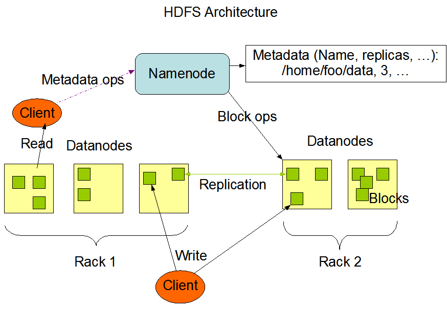
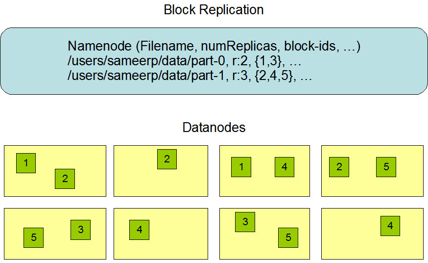
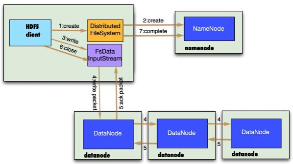
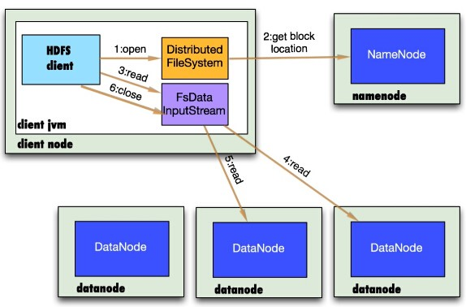

大数据两个问题：
存储和计算。

Hadoop的思想之源：Google
面对的数据和计算难题：
- 大量的网页怎么存储
- 搜索算法
技术和难题：
- GFS
- Map-Reduce
- BigTable

Hadoop组件：
1.HDFS(Hadoop Distributed File System)
2.Map-Reduce
3.YARN

HDFS(Hadoop Distributed File System)：
- 高容错
  1. 数据自动保存多个副本
  2. 副本丢失后，自动恢复
- 适合批处理
  1. 移动计算而非数据
  2. 数据位置暴露给计算框架
- 适合大数据处理
  1. GB、TB、PB
  2. 百万规模以上的文件数量
  3. 10K+ 节点
- 可构建在廉价机器上
  1. 通过多副本提高可靠性
  2. 提供了容错和恢复机制
- 低延迟数据访问
  1. 比如毫秒级
  2. 低延迟与高吞吐率
- 小文件读取
  1. 占用NameNode大量内存
  2. 寻道时间超过读取时间
- 并发写入、文件随机修改
  1. 一个文件只能有一个写者
  2. 仅支持append

HDFS架构： 
-  

DataNode：存储数据
- 文件被切分为固定大小的数据块
  1. 默认数据块大小为128MB（2.X）（在1.x中为64MB），可以配置
  2. 若文件大小不到128MB，则单独存成一个Block
- 一个文件存储方式
  1. 按大小被切分成若干个Block，存储到不同的节点上
  2. 默认情况下每个Block都有三个副本
- Block大小和副本数量通过Client端上传文件时设置，文件上传成功后副本数可以变更，Block Size不可变更。

HDFS的设计思想： 
-  

NameNode(NN)：保存Meta Data
- NameNode主要功能：接受客户端的读写服务
- NameNode保存meta data信息：
  1. 文件ownership和permissions
  2. 文件包含哪些块
  3. Block保存在哪个DataNode(由DataNode启动时上报)
- NameNode的metadata信息在启动后会加载到内存
  1. metadata存储到磁盘文件名为”fsimage”
  2. Block的位置信息不会保存到fsimage
  3. edits记录对metadata的操作日志
   
为什么不直接操作fsimage文件？ 
因为，fsimage位于磁盘，若直接修改，则频繁IO或者线程阻塞等问题。 
随着时间的增加，fsimage文件已经过时，需要修改更新。这个工作是由SecondaryNameNode来完成。 

SecondaryNameNode(SNN):
- 它不是NN的备份(但可以做备份)，它的主要的工作是帮助NN合并edits log，修改fsimage,减少NN启动时间。
- SNN执行合并时机
  1. 根据配置文件设置的时间间隔fs.checkpoint.period默认为3600s
  2. 根据配置文件设置edits log大小fs.checkpoint.size规定edits文件的最大值，默认是64MB

DataNode(DN):
- 存储数据(Block)
- 启动DN线程时会向NN汇报Block信息
- 通过向NN发送心跳保持与其联系(3s一次)，如果NN10min没有收到DN的心跳，则认为其已经lost，并copy其上的Block到其他的DN

Block副本策略
- 第一个副本：放置在上传文件的DN;如果是集群外提交，则随机挑选一台磁盘不太满，CPU不太忙的节点。
- 第二个副本：放置在与第一个副本不同的机架的节点上。
- 第三个副本：与第二个副本相同的机架的节点。
- 更过副本：随机节点

HDFS的写流程
- 

NameNode接受写请求。 

HDFS的读流程
- 

NameNode的接受读请求，NN的元数据记录文件的Block的详细信息。

HDFS文件权限
- 与Linux文件权限类似
  1. r:read, w:write, x:execute，权限x对于文件忽略，对于文件夹表示是否允许访问其访问
- 如果Linux系统用户zhangsan使用hadoop命令创建一个文件，那么这个文件在HDFS中的owner就是张三

安全模式
- NameNode启动时，首先将映像文件fsimage载入内存，并执行编辑日志edits中的各项操作
- 一旦在内存中成功建立文件系统元数据的映射，则创建一个新的fsimage文件（这个操作不需要SecondaryNameNode）和一个空的编辑日志
- 此刻NameNode运行在安全模式。即NameNode的文件系统对于客户端来说是只读的
- 在此阶段NameNode收集各个DataNdoe的报告，当数据块达到最小副本数以上时，还会被认为是“安全的”，在一定的比例(可设置)的数据块被确定为“安全”后，在过若干时间，安全模式结束
- 当检测到副本数不足的数据块时，该块会被复制直到达到最小的副本数，系统中数据块的位置并不是由NameNode维护的，而是以块列表的形式存储在DataNode中
