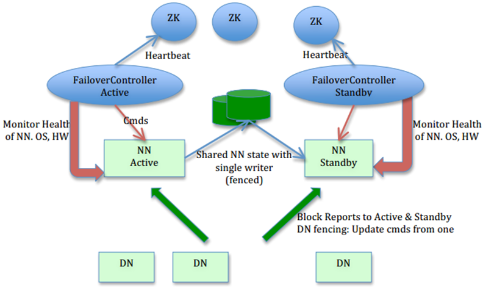

HDFS2.X
- 解决HDFS1.0中单点故障和内存受限问题
- 解决单点故障
  1. HDFS HA：通过主备NameNode解决
  2. 如果主NameNode发生故障，则切换到备NameNode上
- 解决内存受限问题
  1. HDFS Federation
  2. 水平扩展，支持多个NameNode
  3. 每个NameNode分管一部分目录
  4. 所有NameNode共享所有DataNode存储
- 2.x仅是架构上发生了变化，使用方式不变
- 对HDFS使用者透明
- HDFS1.X中的命令和API仍可以使用

HDFS2.X Architecture  
 
NameNode获取客户端的读写请求、存放metadata。
两个NN一致性的关键：

(1)初始化时，一个NN format，另外一个不用format，直接共享初始化的元数据（fsimage）。 
(2)共享edits文件 
这两个关键是共享文件放在JouralNodes集群中。同时JouralNodes来处理fsimage和edits的合并。同时合并Active和Standby内存中元数据。 
DataNode会向两个NN汇报Block的位置信息。 
Standby和Active的唯一区别就是Standby不接受客户端的请求。 
Standby接管Active-Zookeeper的FailoverController节点。 
FailoverController和NN是一一对应的，并且状态的是一致的。 
FailoverController：
1. 通过远程命令的方式，控制NN状态的切换
2. 对NN进行健康检查，FailoverController向Zookeeper汇报
Zookeeper：
1. 内存数据库，保存了各个NN的状态。
2. 选举。

