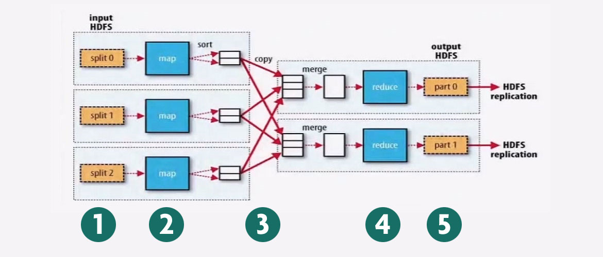
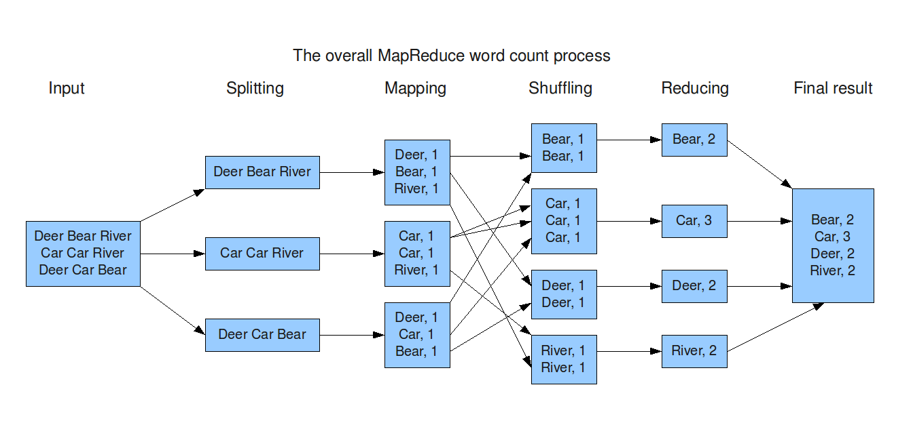
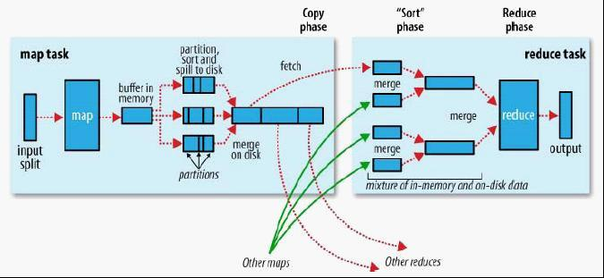

Hadoop MR
- Hadoop分布式计算框架(MapReduce)
- 移动计算，而不移动数据

MapReduce Architecture 
 
1.split：将整个文件进行切割，实际上切割的是Block，得到数据片段 
2.map：一个Map程序就是Map任务，有几个数据片段就有几个Map任务，一个Map任务对应着一个数据片段，一个Map就是一个线程，线程之间是独立的。Map输入和输出的数据是键值对形式 
3.sheffle：partition、sort、merge 
4.reduce：Reduce线程即Reduce任务task。默认情况下，只有一个Reduce任务。可以通过设置，改变Reduce任务的个数。一个Reduece任务对应着一个输出文件 

MapReduce示例： 
 

Mapper:
- Map-Reduce的思想是"分为治之" 
  Mapper负责"分"，即把复杂的任务分解为若干个"简单的任务"执行
- "简单的任务" 
  (1)数据或计算规模相对于原任务要大大缩小 
  (2)就近计算，即会被分配到存放了所需数据的节点进行计算 
  (3)这些小任务可以并行计算，彼此间几乎没有依赖关系 

Reducer:
- 对Map阶段的结果进行汇总
- Reducer的数目由mapred-site.xml配置文件里的项目mapred.reduce.tasks决定或者在代码中更改。缺省值为1，用于可以覆盖。

Shuffle:
- 在map和reduce中间的步骤
- 把mapper输出按照某种key值重新切分和组合成n份，把key值符合某种范围的输出送到特定的reduce那里去处理
- 可以简化reducer过程 
 
map -> buffer in memory -> partition,sort and spill to disk -> merge on disk -> fetch -> merge -> sort -> reduce 
每一个键的hashCode % reduce的数量 来确定分区号，分区号确定到哪个reduce去执行. 
默认的排序为键的hashCode的字典顺序。 

Hadoop shuffle过程详解:
- 每个map task都有一个内存缓冲区(默认是100MB)，存储着map的输出结果
- 当缓冲区快满的时候需要将缓冲区的数据以一个临时文件的方式存放到磁盘spill to disk
- spill to disk是由单独线程来完成的，不影响往缓冲区写map结果的线程(spill.percent，默认是0.8)
- 当spill线程启动后，需要对这80MB空间内的key做sort
- 若Client设置过Combiner，将有相同key的key/value对的value加起来，减少spill to disk的数据量。
- 当整个map task结束后再对磁盘中整个map task产生的所有临时文件做合并merge
- reduce copy过来的数据先放在内存缓冲区中，这个缓冲区是基于JVM的heap size设置

MapReduce的split的大小：
- max.split(100M)
- min.split(10M)
- block(128M)
- max(min.split, min(max.split, block)) 
任何一个碎片段的大小不能超过一个block。 

